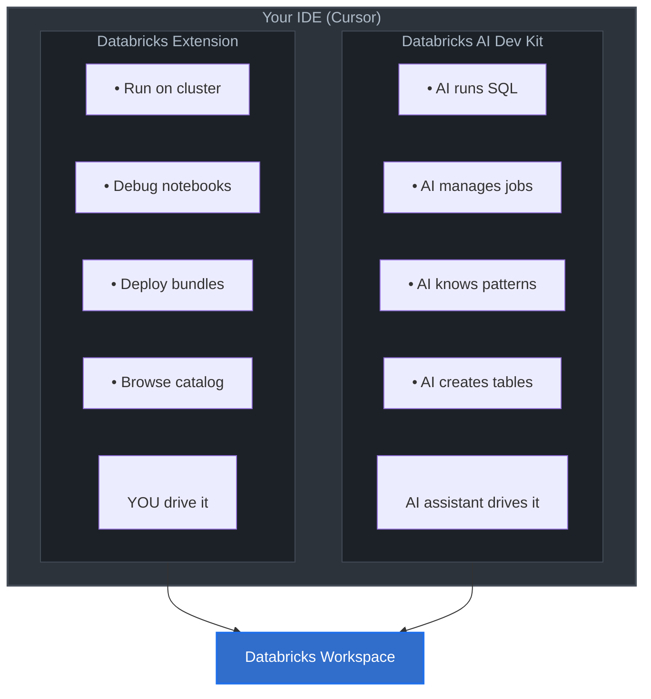

After setting up the [Databricks extension in Cursor](/2026/02/18/databricks-extension-setup.html), I discovered the [Databricks AI Dev Kit](https://github.com/databricks-solutions/ai-dev-kit) which is basically a toolkit that gives AI coding assistants like Cursor direct access to Databricks operations through the Model Context Protocol (MCP).

Here's what I learned setting it up, including what worked and what didn't.

## Table of Contents
- [TL;DR: What I Liked and Didn't Like](#tldr-what-i-liked-and-didnt-like)
- [What Is the Databricks AI Dev Kit?](#what-is-the-databricks-ai-dev-kit)
- [How It Complements the Databricks Extension](#how-it-complements-the-databricks-extension)
- [Prerequisites](#prerequisites)
- [Installation](#installation)
- [What You Get](#what-you-get)
- [Verification](#verification)
- [Troubleshooting](#troubleshooting)
- [Next Steps](#next-steps)

## TL;DR: What I Liked and Didn't Like

| ✅ What I Liked | ❌ What I Didn't Like |
|----------------|---------------------|
| **No more context switching** - Don't have to keep navigating to the Databricks UI to check table schemas or run quick queries | **Manual installation required** - The interactive install script doesn't work from AI agent context (uses `/dev/tty`), so you have to do it manually |
| **Skills are well-documented** - Each skill has clear patterns and examples for things like DLT pipelines and MLflow workflows | **Another venv to manage** - You need a separate Python environment, which adds complexity (though it's necessary to avoid dependency conflicts) |
| **Separate from the extension** - The AI Dev Kit and Databricks extension work together without conflicting | **Path configuration is finicky** - The MCP config needs absolute paths (not `~/`), which can be error-prone |
| **Rich tool selection** - 90+ tools covering SQL, pipelines, jobs, Unity Catalog, vector search, model serving, etc. | **Limited visibility into what's happening** - When the AI assistant calls MCP tools, it's not always clear what's being executed under the hood |

## What Is the Databricks AI Dev Kit?

The AI Dev Kit is a toolkit from Databricks Field Engineering that extends your AI coding assistant's capabilities with Databricks-specific knowledge and operations. It has three main components:

| Component | Description | What It Does |
|-----------|-------------|--------------|
| **MCP Server** | 90+ executable tools | Execute SQL, deploy pipelines, manage jobs, query Unity Catalog, etc. |
| **Skills** | 32 markdown guides | Teach patterns for DLT, MLflow, model serving, Unity Catalog, etc. |
| **Core Library** | Python package | Build custom integrations with LangChain, OpenAI SDK, etc. |

The MCP server is the most immediately useful - it gives your AI assistant the ability to **do things** in Databricks directly from your IDE, not just suggest code.

## How It Complements the Databricks Extension

I initially thought the AI Dev Kit might replace the Databricks extension and my previous work wouldd be useless, but they're actually complementary:

| Tool | Primary Use Case | When to Use |
|------|------------------|-------------|
| **Databricks Extension** | Interactive development | Writing/debugging Spark code, running notebooks locally, connecting to remote clusters |
| **AI Dev Kit MCP Server** | AI-assisted operations | Let your AI assistant query tables, deploy pipelines, manage jobs, without manual context-switching |

**In practice:** I use the extension for hands-on coding (Databricks Connect, running `.py` files against clusters) and the MCP server when I want my AI assistant to help with operational tasks (checking table schemas, running queries, deploying resources).

### Visual Overview

Here's how they work together in your IDE:



## Prerequisites

You'll need:

- **Python 3.11+**
- **uv** (Python package manager) - [install instructions](https://docs.astral.sh/uv/getting-started/installation/)
- **Databricks CLI** (>= 0.278.0) - [install instructions](https://docs.databricks.com/en/dev-tools/cli/install.html)
- **Databricks authentication** configured (OAuth or PAT in `~/.databrickscfg`)
- **AI coding assistant** with MCP support (Cursor, Claude Desktop, etc.)

If you already [set up the Databricks extension](/2026/02/18/databricks-extension-setup.html), you likely have most of these.

## Installation

The [official install script](https://github.com/databricks-solutions/ai-dev-kit?tab=readme-ov-file#install-in-existing-project) is interactive (uses `/dev/tty` for prompts), which gave me some trouble so I did a manual installation instead.

### Step 1: Clone the Repository

```bash
# Clone to a dedicated location (not your project directory)
mkdir -p ~/.ai-dev-kit
cd ~/.ai-dev-kit
git clone https://github.com/databricks-solutions/ai-dev-kit.git repo
cd repo
git checkout v0.1.0  # Or latest stable version
```

### Step 2: Create a Separate Python Environment

**Important:** Use a **separate** virtual environment from your Databricks Connect `.venv/`. The AI Dev Kit has different dependencies (fastmcp, sqlglot, litellm) that could conflict with PySpark.

```bash
cd ~/.ai-dev-kit
uv venv --python 3.11
```

### Step 3: Install the MCP Server and Core Library

```bash
uv pip install --python .venv/bin/python \
  -e repo/databricks-tools-core \
  -e repo/databricks-mcp-server
```

### Step 4: Install Skills to Your Project

Skills are markdown files that teach your AI assistant Databricks patterns. Install them to your project's `.cursor/skills/` directory:

```bash
cd /path/to/your/project  # Your actual project directory
mkdir -p .cursor/skills

# Install all Databricks skills
for skill in ~/.ai-dev-kit/repo/databricks-skills/databricks-*; do
  cp -r "$skill" .cursor/skills/
done

# Install all MLflow skills
for skill in ~/.ai-dev-kit/repo/databricks-skills/mlflow-*; do
  cp -r "$skill" .cursor/skills/
done
```

This installs:
- **24 Databricks skills**: Unity Catalog, jobs, pipelines, model serving, vector search, apps, etc.
- **8 MLflow skills**: Evaluation, tracing, metrics, etc.

### Step 5: Configure the MCP Server for Cursor

Create an MCP configuration file in your project:

```bash
cd /path/to/your/project
mkdir -p .cursor
```

Create `.cursor/mcp.json`:

```json
{
  "mcpServers": {
    "databricks": {
      "command": "/Users/yourusername/.ai-dev-kit/.venv/bin/python",
      "args": ["/Users/yourusername/.ai-dev-kit/repo/databricks-mcp-server/run_server.py"],
      "env": {
        "DATABRICKS_CONFIG_PROFILE": "DEFAULT"
      }
    }
  }
}
```

**Replace** `/Users/yourusername/` with your actual home directory path. You can find it with:

```bash
echo ~
```

**Profile note:** The `DATABRICKS_CONFIG_PROFILE` should match a profile in your `~/.databrickscfg` file. I used `cursor` (a separate profile I created), but you can use `DEFAULT` if that's your main profile.

### Step 6: Enable MCP Server in Cursor

1. Open **Cursor Settings** (Cmd+, or Ctrl+,)
2. Search for **MCP**
3. Find the **Databricks** server entry
4. Toggle it **ON**

You may need to restart Cursor for the changes to take effect.

## What You Get

Once installed, your AI assistant has access to:

### 90+ MCP Tools

Here's a subset of what's available (organized by category):

| Category | Example Tools |
|----------|---------------|
| **SQL & Data** | `execute_sql`, `execute_sql_multi`, `get_table_details`, `list_warehouses` |
| **Unity Catalog** | `manage_uc_objects` (create/drop catalogs, schemas, volumes), `manage_uc_grants`, `manage_uc_tags` |
| **Pipelines (DLT)** | `create_or_update_pipeline`, `start_update`, `stop_pipeline`, `get_pipeline_events` |
| **Jobs** | `create_job`, `run_job_now`, `get_run`, `wait_for_run`, `cancel_run` |
| **Clusters** | `list_clusters`, `get_best_cluster`, `start_cluster`, `get_cluster_status` |
| **Model Serving** | `list_serving_endpoints`, `query_serving_endpoint`, `get_serving_endpoint_status` |
| **Vector Search** | `create_vs_index`, `query_vs_index`, `upsert_vs_data`, `sync_vs_index` |
| **Genie Spaces** | `create_or_update_genie`, `ask_genie`, `ask_genie_followup` |
| **Dashboards** | `create_or_update_dashboard`, `publish_dashboard`, `list_dashboards` |
| **Apps** | `create_app`, `deploy_app`, `get_app_logs` |
| **Volumes** | `upload_to_volume`, `download_from_volume`, `list_volume_files` |
| **Files** | `upload_file`, `upload_folder`, `run_python_file_on_databricks` |

See the full list in the [MCP server directory](https://github.com/databricks-solutions/ai-dev-kit/tree/main/databricks-mcp-server).

### 32 Skills

Skills teach your AI assistant Databricks best practices and patterns. The 32 installed skills cover data engineering (Spark pipelines, streaming), ML/AI (MLflow, model serving, vector search), orchestration (jobs, apps), Unity Catalog governance, and more. Many include extensive sub-guides (e.g., `spark-declarative-pipelines` has 10 guides covering ingestion, SCD Type 2, performance tuning, etc.).

See the full list in the [databricks-skills directory](https://github.com/databricks-solutions/ai-dev-kit/tree/main/databricks-skills).

## Verification

To verify the MCP server is working, ask your AI assistant to run a simple query:

**Example prompt:**
> "List all SQL warehouses in my Databricks workspace"

If it's working, your assistant will call the `list_warehouses` MCP tool and return results like:

```
Found 3 warehouses:
- Serverless Starter Warehouse (id: abc123, state: RUNNING)
- Analytics Warehouse (id: def456, state: STOPPED)
- ML Warehouse (id: ghi789, state: RUNNING)
```

You can also test table queries:

> "Show me the schema of the table `main.default.sample_table`"

The assistant should call `get_table_details` and return column names, types, and table metadata.

## Troubleshooting

### MCP Server Not Showing Up in Cursor

**Symptoms:** The Databricks MCP server doesn't appear in Cursor settings.

**Fix:**
1. Verify `.cursor/mcp.json` exists and has correct paths
2. Check that paths are **absolute** (not `~/`, use full `/Users/yourusername/`)
3. Restart Cursor completely (not just reload window)
4. Check Cursor's logs: **View → Developer Tools → Console** for MCP errors

### "Permission Denied" Errors

**Symptoms:** MCP tools fail with authentication errors.

**Fix:**
1. Verify your Databricks profile is configured: `databricks auth login --profile <profile_name>`
2. Check that `DATABRICKS_CONFIG_PROFILE` in `mcp.json` matches a valid profile in `~/.databrickscfg`
3. If using OAuth, your token may have expired - re-authenticate with: `databricks auth login --profile <profile_name>`

### Python Import Errors

**Symptoms:** `ModuleNotFoundError: No module named 'databricks_tools_core'`

**Fix:**
1. Verify the MCP server's Python environment has the packages:
   ```bash
   ~/.ai-dev-kit/.venv/bin/python -c "import databricks_tools_core; print('OK')"
   ```
2. If it fails, reinstall:
   ```bash
   cd ~/.ai-dev-kit
   uv pip install --python .venv/bin/python -e repo/databricks-tools-core -e repo/databricks-mcp-server
   ```

### Skills Not Loading

**Symptoms:** Your AI assistant doesn't seem aware of Databricks patterns.

**Fix:**
1. Verify skills are in `.cursor/skills/`:
   ```bash
   ls .cursor/skills/
   ```
   You should see directories like `databricks-python-sdk/`, `spark-declarative-pipelines/`, etc.
2. Each skill directory should have a `SKILL.md` file
3. Try explicitly mentioning a skill in your prompt: "Using the databricks-python-sdk skill, show me how to list clusters"

## Next Steps

Now that you have the MCP server installed, here are some things to try:

1. **Explore pipelines:** Ask your assistant to create a simple Delta Live Tables pipeline using `create_or_update_pipeline`
2. **Query Unity Catalog:** Inspect schemas, catalogs, and permissions with `manage_uc_objects` and `get_table_details`
3. **Run jobs:** Trigger and monitor Databricks jobs with `run_job_now` and `wait_for_run`
4. **Deploy models:** Use the model serving tools to deploy and query ML endpoints
5. **Read the skills:** Check out `.cursor/skills/spark-declarative-pipelines/SKILL.md` for pipeline patterns

The AI Dev Kit makes it much faster to work with Databricks operationally, without constantly context-switching to the web UI.

---

## Want to Connect?

If you're experimenting with AI coding tools and Databricks, I'd love to hear what you're learning. Connect with me on [LinkedIn](https://linkedin.com/in/patilnivedita) or check out my code on [GitHub](https://github.com/niveditanpatil).

---

## References

- [Databricks AI Dev Kit GitHub Repository](https://github.com/databricks-solutions/ai-dev-kit)
- [Model Context Protocol (MCP) Specification](https://modelcontextprotocol.io/)
- [Databricks SDK for Python Documentation](https://databricks-sdk-py.readthedocs.io/)
- [Previous post: Setting Up Databricks Extension in VS Code and Cursor](/2026/02/18/databricks-extension-setup.html)
